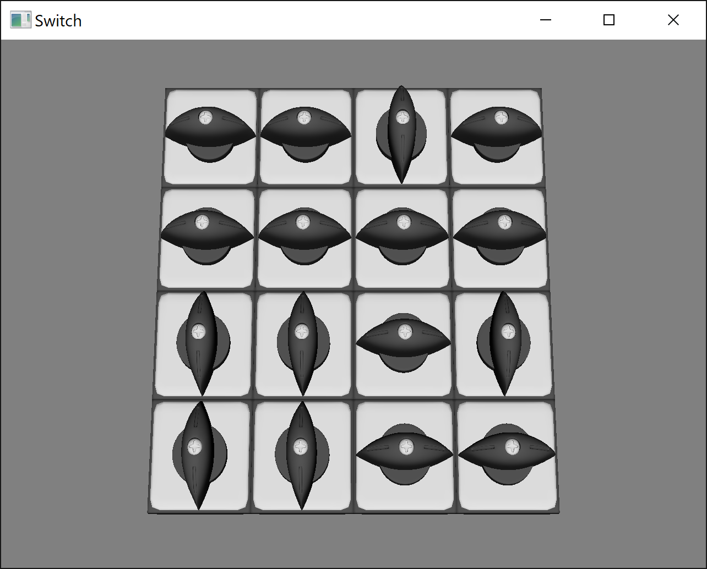

# Switch

Switch is a small logic game that demonstrates usage of [Pixar USD and
Hydra](https://github.com/PixarAnimationStudios/USD) on Windows.

To win the game, you need to turn all the switches to the horizontal state.



## Modification from original repos

This repository is an adaptation of [https://github.com/VictorYudin/switch](https://github.com/VictorYudin/switch). Modifications are:

* remove AppVeyor dependencies
* USD 23.08 compatibility
* glfw and glew submodules
* compilation with cmake

## Supported platforms

Switch has been tested on Linux (Rocky 8).

## dependencies

Required:
* cmake
* gcc
* OpenGL 4.5
* USD 23.08

## Build

Set an env var to the built USD location
```bash
export PXR_USD_LOCATION=/path/to/root/USD
```

Set the destination location of your build
```bash
export CMAKE_INSTALL_PREFIX=/path/to/install/folder
```

From the UsdSwitchGame folder, build using cmake
```bash
mkdir build
cd build
cmake .. -DCMAKE_INSTALL_PREFIX=$CMAKE_INSTALL_PREFIX
make
make install
```

## Run the game

Set the env var to be able to run the game
```bash
export LD_LIBRARY_PATH=$PXR_USD_LOCATION/lib:$PXR_USD_LOCATION/lib64:$LD_LIBRARY_PATH
export LD_LIBRARY_PATH=$CMAKE_INSTALL_PREFIX/lib:$CMAKE_INSTALL_PREFIX/lib64:$LD_LIBRARY_PATH
```

Run the game
```bash
cd $CMAKE_INSTALL_PREFIX/bin
./switch
```
